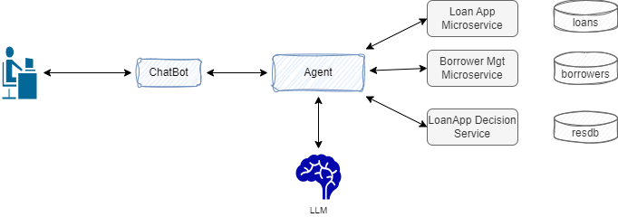

# IBM Miniloan ODM demonstration with Agent


## Goals

The Miniloan application is part of the IBM Operational Decision Management product and [tutorial](https://www.ibm.com/docs/en/odm/8.12.0?topic=rules-tutorials). The goal of this demonstration is to illustrate how unstructured query in natural language can be decomposed and call to decision service to get a loan application pre-approved can be done with Owl Framework.

The questions that are tested and validated are:

* What is the credit score of Robert Smith?
* 

## Architecture

The high level the architecture for this demonstration looks like in the figure below:



* A chatbot supports the interactions with a customer support representative with natural language queries
* The assistant server manages the conversation and the integration with different backends
* The Loan App Decision service is the SAMPLE RuleApp deployed in a Rule Execution Server
* The different microservices to access the client database as future or existing borrowers, and the loan applications repository.
* The LLM is an externally deployment Large Language Model for inference accessible via API.

To make it easier the loanApp and client the repositories are mockup and loaded in memory.

## Demonstration Flows

* Start the docker compose with all the components of the above architecture.

```sh
cd IBM-MiniLoan-demo/deployment/local/
docker compose up -d
```

The backend APIs is available at the following URL [http://localhost:8000/docs](http://localhost:8000/docs).

* Run a demonstration scripts to validate the deployment:

```sh
python non_regression_tests.py
```

## Agentic with Rule Engine

This section explains the code approach to use Agent for tool calling.

* diagram
* tool definition
* tool factory

## Development around the demonstration

In case you need to work on the current demonstration, and run some of the test cases, this section addresses what needs to be done to run on you local laptop with Docker engine.

### Unit tests

* Define the PYTHONPATH so the core module can be accessed in the unit tests

    ```sh
     export PYTHONPATH=$WHERE_YOUR_CODE_IS/athena-owl-core/owl-agent-backend/src
    ```